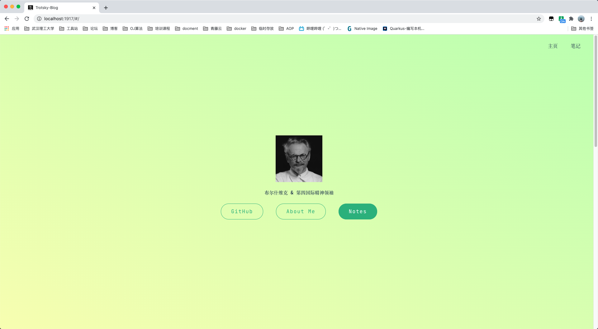
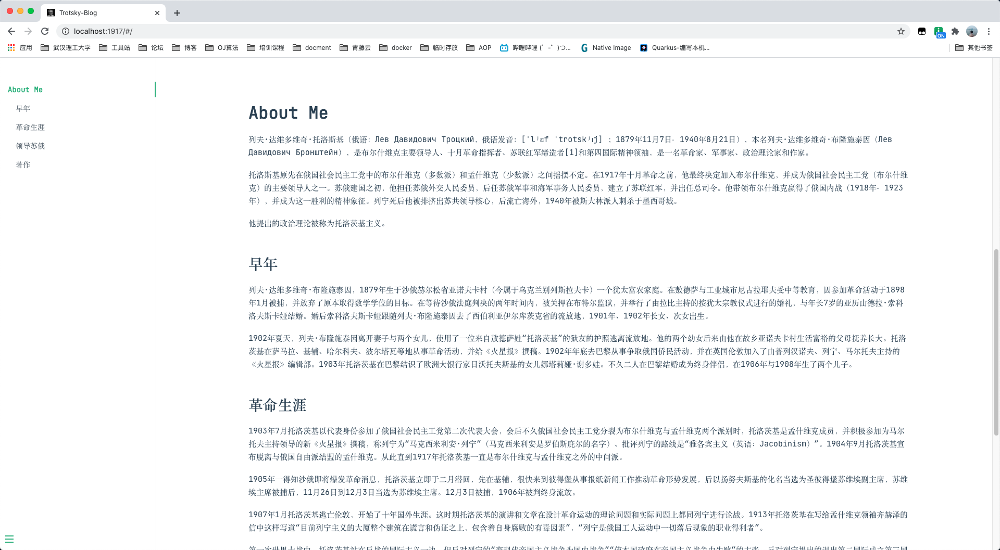
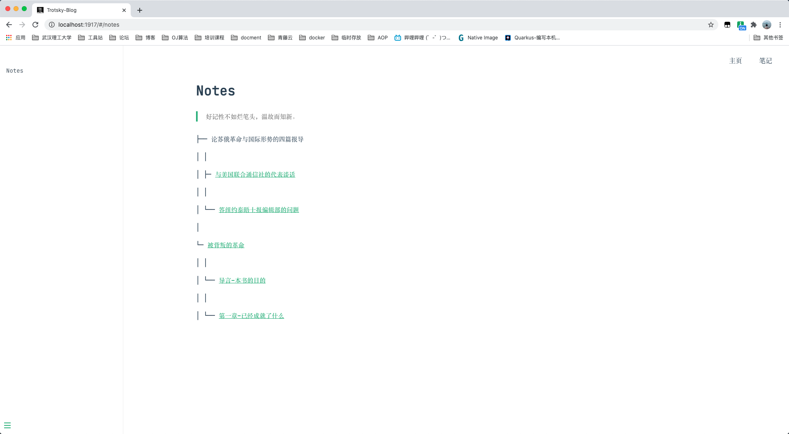

<h1 align="center">Trotsky</h1>

> Trotsky 是一款轻量、云原生的博客写作平台。

---

## 简介

**Trotsky** `[托洛茨基]`，仅纪念伟大革命先驱。

使用`Quarkus`+`graalvm`+`native-image`打包成可执行的二进制文件，运行于`Docker`等运行时环境之上。

## 效果展示

### 主页

Trotsky会帮你生成如下图的首页，你可以对logo、简介、连接等进行配置。



### About-Me

同时也会生成一个人介绍页面，你可以在后台，已markdown的语法编辑它。



### Notes

**对于你添加的笔记，Trotsky会自动帮你生成一个笔记树。同时你也可以在后台对其进行个性化的配置。**

区别于其他写作平台，我想这个笔记树页面是我的特点。原因有一下几点：

- 对于初学者，往往记录学习的笔记的需求远远大于写技术输出的博客

- 对于博客的写作，创作都是以一篇一篇为单位，相似的内容很难归类在一起，而这颗笔记树可以。



## 编译

```shell script
./gradlew build -Dquarkus.package.type=native -Dquarkus.native.additional-build-args=-H:ResourceConfigurationFiles=resources-config.json
```

编译结束之后，会在`build`目录下生成一个`trotsky-beta-runner`的可执行文件。

## 运行

```shell script
./build/trotsky-beta-runner
```

令人惊讶的启动速度：**started in 0.019s**

## 构建镜像


## About Trotsky


列夫·达维多维奇·托洛茨基（1879年11月7日－1940年8月21日），是布尔什维克主要领导人、十月革命指挥者、苏联红军缔造者和第四国际精神领袖，是一名革命家、军事家、政治理论家和作家。

托洛茨基原先在俄国社会民主工党中的布尔什维克（多数派）和孟什维克（少数派）之间摇摆不定。在1917年十月革命之前，他最终决定加入布尔什维克，并成为俄国社会民主工党（布尔什维克）的主要领导人之一。苏俄建国之初，他担任苏俄外交人民委员，后任苏俄军事和海军事务人民委员，建立了苏联红军，并出任总司令。他带领布尔什维克赢得了俄国内战（1918年－1923年），并成为这一胜利的精神象征。

